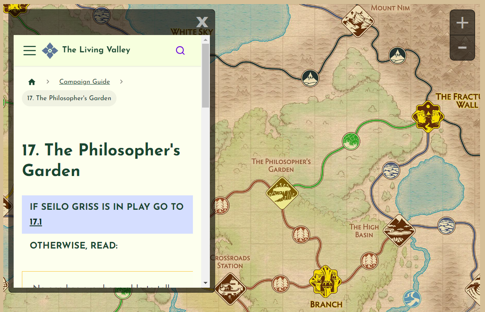

# ebr-interactive-map
A web-based interactive map for use alongside the cooperative adventure card game Earthborne Rangers

# Explanation of current files
* arcology_map.html: This is the main HTML file of the Legacy of the Ancestors map, containing an SVG to render the map and JavaScript to allow interactivity
* EBR001_Valley Map_eng.jpg: The map image from Lure of the Valley
* EBR023_Deluxe LotA Map_eng.jpg: The map image from Legacy of the Ancestors
* locations.js: This is a JavaScript file containing one variable named `locationData`, which is an array containing information about all of the current locations on the map.
* LV-9slice-*.png: These are the nine pieces of the Living Valley popup background.
* styles.css: This is a standard CSS file containing the styles for making the page and links look a certain way.
* valley_map.html: This is the main HTML file of the Lure of the Valley map, containing an SVG to render the map and JavaScript to allow interactivity

# Current Features
* Valley map is rendered via SVG
* Map can be panned by clicking and dragging or by touching and dragging
* Map can be zoomed in and out by clicking the zoom buttons in the top right or by using scroll wheel
* Each location has an invisible button that highlights when hovered/clicked
* When clicked, each location opens an iframe with the corresponding Living Valley entry in it
* Living Valley entry shows up on custom nine-slice background
* Menu button opens a menu to switch between maps

# Potential Features (TODO)
* Add map overlays from expansions
* Add options in menu
* Add animation (zoom in, zoom out, menu open, menu close, open Living Valley iframe, automatically pan map to bring Living Valley iframe into view)
* Add functionality to allow users to take notes at specific locations
* Add functionality to allow users to search and highlight locations based on traits

# Known Bug(s)
* Using touch control over an open menu does not scroll the menu and instead pans the map
* The menu button is hacky and ugly when the menu is opened